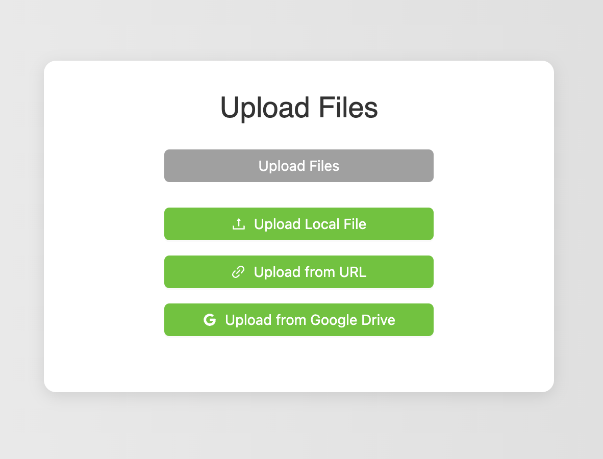

# File Upload Application

## HomePage


<br>

## Upload Menu Options



<br>

## File View Options


This project is a file upload application built with React and Firebase. It allows users to upload files from their local system, Google Drive, or via URL. The application also includes a progress bar to show the upload status and a modal to view uploaded files.

## Table of Contents

- [Getting Started](#getting-started)
- [Prerequisites](#prerequisites)
- [Installation](#installation)
- [Environment Variables](#environment-variables)
- [Available Scripts](#available-scripts)
- [Project Structure](#project-structure)
- [Usage](#usage)
- [Contributing](#contributing)
- [License](#license)

## Getting Started

Follow these instructions to set up and run the project on your local machine.

## Prerequisites

Make sure you have the following installed on your machine:

- [Node.js](https://nodejs.org/) (v14 or higher)
- [npm](https://www.npmjs.com/) (v6 or higher)
- [Firebase Account](https://firebase.google.com/)
- [Google Cloud Platform Account](https://cloud.google.com/)

## Installation

1. Clone the repository:

   ```sh
   git clone https://github.com/your-username/file-upload-app.git
   cd file-upload-app

2. Install the dependencies: npm install

Create a .env file in the root directory of your project and add the following environment variables:

REACT_APP_FIREBASE_API_KEY=your-firebase-api-key
REACT_APP_FIREBASE_AUTH_DOMAIN=your-firebase-auth-domain
REACT_APP_FIREBASE_PROJECT_ID=your-firebase-project-id
REACT_APP_FIREBASE_STORAGE_BUCKET=your-firebase-storage-bucket
REACT_APP_FIREBASE_MESSAGING_SENDER_ID=your-firebase-messaging-sender-id
REACT_APP_FIREBASE_APP_ID=your-firebase-app-id
REACT_APP_FIREBASE_MEASUREMENT_ID=your-firebase-measurement-id

REACT_APP_CLIENT_ID=your-google-client-id
REACT_APP_API_KEY=your-google-api-key
REACT_APP_SCOPE=https://www.googleapis.com/auth/drive.file

Note : Replace the placeholder values with your actual Firebase and Google API credentials.

Available Scripts
In the project directory, you can run:

npm start
Runs the app in development mode.
Open http://localhost:3000 to view it in your browser.

The page will reload when you make changes.
You may also see any lint errors in the console.

npm test
Launches the test runner in interactive watch mode.
See the section about running tests for more information.

npm run build
Builds the app for production to the build folder.
It correctly bundles React in production mode and optimizes the build for the best performance.

The build is minified and the filenames include the hashes.
Your app is ready to be deployed!

Project Structure

<br>


1. Usage
Start the development server: npm start

2. Open http://localhost:3000 in your browser to view the application.

3. Use the "Upload Files" button to upload files from your local system, Google Drive, or via URL.

4. View the uploaded files by clicking the "View Uploaded Files" button.

Contributing

Contributions are welcome! Please follow these steps to contribute:

1. Fork the repository.
2. Create a new branch (git checkout -b feature-branch).
3. Make your changes.
4. Commit your changes (git commit -m 'Add some feature').
5. Push to the branch (git push origin feature-branch).
6. Open a pull request.


